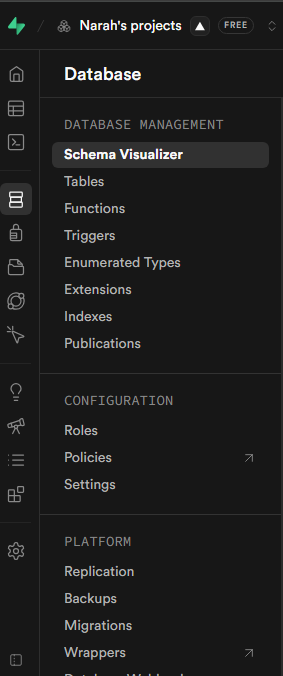

# Catálogo Digital Minimalista

Sistema completo com Frontend (Next.js + Tailwind), Backend (Node.js + Express) e Banco de Dados (PostgreSQL).

## Estrutura do Projeto

```
catalogo_digital_/
├── backend/          # API RESTful com Node.js + Express
├── frontend/         # UI com Next.js + Tailwind CSS
├── database/         # Scripts SQL de migração
└── README.md
```

## Pré-requisitos

- Node.js >= 18
- PostgreSQL >= 14
- npm ou yarn

## Setup Rápido

### 1. Banco de Dados
```bash
psql -U postgres -c "CREATE DATABASE catalogo_digital;"
psql -U postgres -d catalogo_digital -f database/migrations.sql
psql -U postgres -d catalogo_digital -f database/seeds.sql
```

### 2. Backend
```bash
cd backend
cp .env.example .env
# Edite o .env com suas credenciais
npm install
npm run dev
```

### 3. Frontend
```bash
cd frontend
cp .env.example .env.local
# Edite o .env.local com a URL do backend
npm install
npm run dev
```

## Credenciais de Teste

| Tipo  | Email               | Senha      |
|-------|---------------------|------------|
| Admin | admin@catalogo.com  | Admin@123  |
| User  | user@catalogo.com   | User@123   |

## Endpoints da API

| Método | Rota                        | Proteção | Descrição                        |
|--------|-----------------------------|----------|----------------------------------|
| POST   | /api/auth/register          | Pública  | Cadastro de administrador        |
| POST   | /api/auth/login             | Pública  | Login (retorna JWT)              |
| GET    | /api/dashboard/metrics      | JWT      | Métricas do dashboard            |
| GET    | /api/products               | Pública  | Lista produtos (busca + filtro)  |
| POST   | /api/products               | JWT      | Cria produto                     |
| PUT    | /api/products/:id           | JWT      | Edita produto                    |
| DELETE | /api/products/:id           | JWT      | Deleta produto                   |
| POST   | /api/products/:id/view      | Pública  | Registra visualização            |
